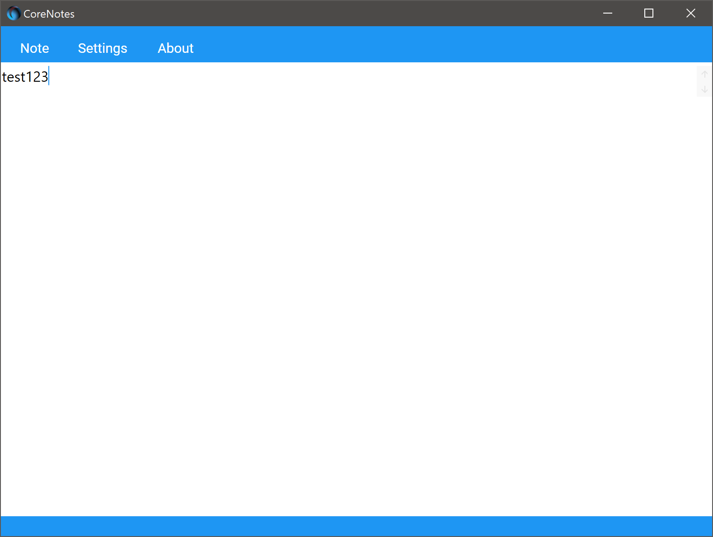

# CoreNotes

*CoreNotes* is a simple MVVM tinkering project. Created to solve a very specific problem I had with Notepad. Everytime I wanted to shutdown my computer, Notepad started yelling that my notes needed to be saved somewhere. *CoreNotes* doesn't yell at you! it simply saves your notes to a sqlite database. It saves when you want, when you shutdown your computer or when you close the *CoreNotes* app.

## Example

In the example below, we open CoreNotes and enter a new note. (test123)

Whenever you 'Exit' the CoreNotes app, the note will be saved to a Sqlite database.

To open the note...
